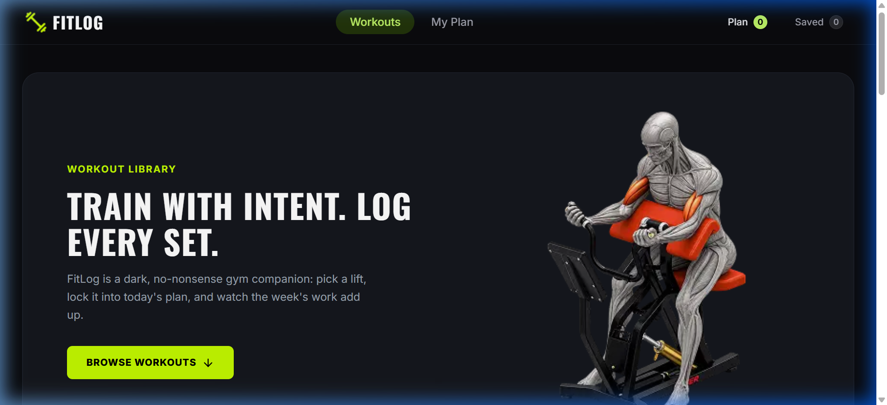

# 🏋️ FITLOG — Workout Library & Training Planner

> **Train with intent. Log every set.**  
> FitLog is a sleek, dark-themed, no-nonsense gym companion and workout planner built with **Next.js 16**, **React 19**, and **Tailwind CSS v4**. Explore a curated library of lifts, lock them into your daily plan, monitor calories and training time live, and log your progress.

---

## 📸 Application Preview



---

## 📖 Project Overview

**FitLog** is an intuitive, modern fitness web application crafted to streamline workout routines for athletes and gym-goers. Designed with a dark gym aesthetic and mobile-first responsiveness, FitLog enables users to:
- **Browse Exercises**: Explore a curated library of strength and hypertrophy exercises targeting every major muscle group (Chest, Back, Arms, Legs, Core).
- **In-depth Workout Details**: Inspect detailed exercise descriptions, step-by-step execution instructions, target muscles, required equipment, and estimated calorie burns.
- **Daily Plan Builder**: Add workouts to **"Today's Plan"** with a strict 5-lift cap to prioritize training quality over exhaustion.
- **Save for Later**: Bookmark exercises in a dedicated saved queue for future workouts.
- **Live Real-Time Analytics**: Monitor cumulative training duration and estimated energy expenditure through a reactive metrics bar.
- **Progress Tracking**: Mark lifts as completed with celebratory notifications and persistent data synchronization across sessions.

---

## 🔗 Project Links

- 🌐 **Live Demo**: [https://fit-log-five-alpha.vercel.app](https://fit-log-five-alpha.vercel.app)
- 💻 **Source Code Repository**: [https://github.com/Nasir-Uddin-Mollah/FitLog](https://github.com/Nasir-Uddin-Mollah/FitLog)
- ⚡ **Backend REST API**: [https://api.api-store.workers.dev/api/fitlog](https://api.api-store.workers.dev/api/fitlog)

---

## 🛠️ Technologies Used

| Category | Technology | Purpose |
|---|---|---|
| **Framework** | [Next.js 16](https://nextjs.org/) (App Router & Turbopack) | Server Components, dynamic routing, and fast bundling |
| **Library** | [React 19](https://react.dev/) | Core UI rendering and reactive state |
| **Language** | [TypeScript](https://www.typescriptlang.org/) | End-to-end type safety and interface modeling |
| **Styling** | [Tailwind CSS v4](https://tailwindcss.com/) & [DaisyUI v5](https://daisyui.com/) | Dark gym aesthetic, responsive layouts, and UI tokens |
| **Icons** | [React Icons](https://react-icons.github.io/react-icons/) (`react-icons/lu`) | Consistent Lucide icon set with **zero raw SVGs** |
| **Notifications** | [React Toastify](https://fkhadra.github.io/react-toastify/) | Dark-themed toast feedback for user actions |
| **State & Storage** | React Context API + HTML5 `localStorage` | Global workout plan state with persistent reload safety |
| **API** | Cloudflare Workers REST API | Live exercise dataset and single workout detail endpoint |

---

## 📦 Dependencies & Packages

### Production Dependencies (`dependencies`)
- **[next](https://www.npmjs.com/package/next)** (`16.3.6`): Modern React framework providing App Router, Turbopack, and SSR capabilities.
- **[react](https://www.npmjs.com/package/react)** (`19.2.8`): UI foundation for building composable and reactive user interfaces.
- **[react-dom](https://www.npmjs.com/package/react-dom)** (`19.2.8`): DOM rendering engine for React 19.
- **[react-icons](https://www.npmjs.com/package/react-icons)** (`^5.7.0`): Icon set library providing consistent Lucide icons (`react-icons/lu`).
- **[react-toastify](https://www.npmjs.com/package/react-toastify)** (`^11.1.0`): Toast notification system with custom dark theme support.

### Development Dependencies (`devDependencies`)
- **[tailwindcss](https://www.npmjs.com/package/tailwindcss)** (`^4`): High-performance, modern utility-first CSS framework.
- **[@tailwindcss/postcss](https://www.npmjs.com/package/@tailwindcss/postcss)** (`^4`): PostCSS integration for Tailwind CSS v4.
- **[daisyui](https://www.npmjs.com/package/daisyui)** (`^5.7.46`): Component library built on Tailwind CSS for badges, buttons, and theme utilities.
- **[typescript](https://www.npmjs.com/package/typescript)** (`^5`): Typed JavaScript compiler for strong typing and developer productivity.
- **[@types/node](https://www.npmjs.com/package/@types/node)** (`^20`): Type definitions for Node.js runtime environments.
- **[@types/react](https://www.npmjs.com/package/@types/react)** (`^19`): TypeScript definitions for React.
- **[@types/react-dom](https://www.npmjs.com/package/@types/react-dom)** (`^19`): TypeScript definitions for React DOM.
- **[eslint](https://www.npmjs.com/package/eslint)** (`^9`): Linter tool for identifying and reporting on code issues.
- **[eslint-config-next](https://www.npmjs.com/package/eslint-config-next)** (`16.3.6`): Official ESLint configuration for Next.js best practices.

---

## ✨ 5 Key Features

### 1. 🏋️ Curated Workout Library (Responsive 3x4 Grid)
- Browse **12 essential compound and isolation exercises** targeting every major muscle group (Chest, Arms, Legs, Back, Core).
- Each workout card showcases an exercise visual, muscle group tag pills, equipment requirements, and key performance stats (Duration, Calories Burned, and Rating).
- Smooth anchor scrolling from the Hero banner straight down to `#library` via the **"BROWSE WORKOUTS"** button.

### 2. 📋 Daily Plan Builder with 5-Lift Cap
- Add workouts to **"Today's Plan"** or **"Saved for Later"** directly from the workout details page.
- **Smart Duplicate Prevention**: Buttons automatically disable once an exercise is already added.
- **5-Lift Daily Cap**: Enforces a focused daily routine (maximum 5 lifts) with feedback toasts to encourage quality training over fatigue.

### 3. ⏱️ Live Metrics Summary Row
- Dynamic dashboard displaying live aggregates across your active routine:
  - **Total Exercises**: Count of scheduled lifts.
  - **Total Minutes**: Cumulative duration of all workouts in the plan.
  - **Total Calories**: Live sum of estimated calories burned.
- Values start at 0 and update automatically whenever exercises are added, completed, or removed.

### 4. 🎯 "Mark as Done" Logging & Action Suite
- Mark workouts as completed with the **"Mark as Done"** check button, which logs the exercise and removes it from the queue with celebratory feedback.
- Individual **Remove (`✕`)** buttons to prune items from either the *Today's Plan* or *Saved* tab.
- Quick **"View Details"** navigation to jump back to full instructions and specifications anytime.

### 5. 📊 Dynamic Multi-Attribute Sorting
- Instantly re-order your active workout plan by:
  - **Duration** (Ascending — quick workouts first)
  - **Calories** (Ascending / Descending by energy burned)
  - **Rating** (Highest community rated first)
- Operates instantly on the client side with custom dropdown chevron controls.

---

## 🌟 Additional Features

- **💾 LocalStorage Persistence**: Plan and saved workout lists automatically persist across page reloads and browser sessions without hydration mismatch.
- **🎨 Custom 404 Page**: Bespoke gym-themed not-found screen (*"404 — MISSED THAT LIFT"*) with pure CSS barbell graphics and quick return navigation.
- **⚡ Themed Loading State**: Minimalist *"WARMING UP — Racking the Weights"* pulse loader for route transitions.
- **📱 Mobile-First Responsive Design**: Optimized navigation with hamburger menu, compact live badge counters, and stacked cards down to 320px viewport width.

---

## 🚀 Getting Started Locally

### Prerequisites
Make sure you have [Node.js](https://nodejs.org/) (v18.18 or higher) and `npm` installed on your machine.
- Verify Node: `node -v`
- Verify npm: `npm -v`

### Installation & Setup

1. **Clone the repository:**
   ```bash
   git clone https://github.com/Nasir-Uddin-Mollah/FitLog.git
   cd FitLog
   ```

2. **Install dependencies:**
   ```bash
   npm install
   ```

3. **Run the development server:**
   ```bash
   npm run dev
   ```

4. **Open in browser:**
   Open [http://localhost:3000](http://localhost:3000) in your web browser to view the application live.

### Building for Production

To create an optimized production build and run it locally:
```bash
# Generate the production build
npm run build

# Start the production server
npm run start
```

### Linting & Code Quality

To run ESLint and inspect code standards:
```bash
npm run lint
```

---

## 📁 Project Structure

```text
fitlog/
├── src/
│   ├── app/
│   │   ├── exercise/[id]/page.tsx   # Dynamic single workout details page
│   │   ├── my-plan/page.tsx         # My Plan management & metrics page
│   │   ├── globals.css              # Tailwind CSS v4 & theme definitions
│   │   ├── layout.tsx               # Root layout with Navbar & Footer
│   │   ├── loading.tsx              # Custom fitness loading component
│   │   ├── not-found.tsx            # Custom 404 "Missed That Lift" page
│   │   └── page.tsx                 # Home page (Banner & Workout Library)
│   ├── assets/                      # Brand assets (logo, hero illustration)
│   ├── components/
│   │   ├── details/                 # Detail page cards, Add/Save buttons
│   │   ├── home/                    # Banner & Library grid components
│   │   └── shared/                  # Responsive Navbar & Footer
│   ├── contexts/                    # WorkoutsContext with localStorage sync
│   ├── hooks/                       # Custom useWorkouts hook
│   └── types/                       # TypeScript interfaces (WorkoutType)
├── public/                          # Static public assets (screenshot.png, icons)
├── package.json                     # Project configuration & dependencies
└── tsconfig.json                    # TypeScript compiler configuration
```
